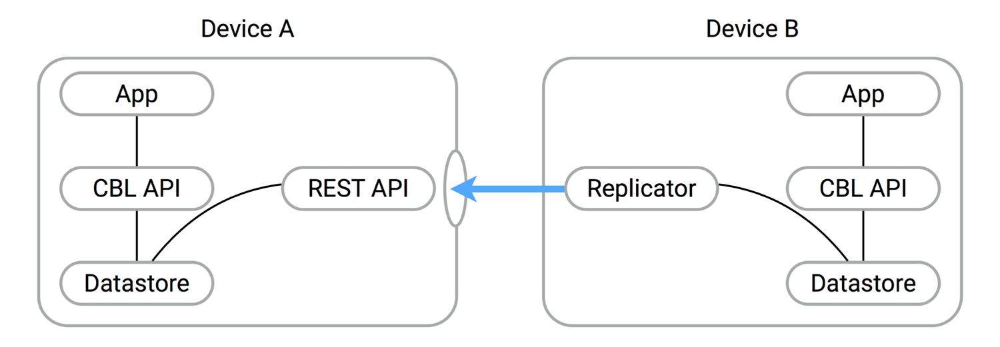

Access to the Listener API can be restricted to the local application, often used in Mobile Frameworks such as PhoneGap and React Native apps (see the hybrid development guide). Or it can be opened to other instances of the application, and even advertized on the network.

In this guide, you will learn how to install the Listener dependency in your application.

## Introduction

The Listener enables any Couchbase Lite database to become the remote in a replication by listening on a TCP port and by exposing the standard replication endpoints on that port.



The Listener API becomes an alternate entry-point into the data store. Another peer can therefor use the URL and port number in the replicator to sync data to and from the database currently listening.

Some typical Listener use cases include:


- Trusted peers only: sync based on a QR code secret, ultrasound etc.
- Peers within a security group: authentication based on peer discovery.
- Wide open: experimental social messaging apps.
- Offline/online: use peer-to-peer in conjunction with Sync Gateway.

## Installing the Listener library

### iOS

- Using Cocoapods Declare the Listener sub-spec in the Podfile:

```
pod 'couchbase-lite-ios/Core', '~> 1.1.0'
pod 'couchbase-lite-ios/Listener', '~> 1.1.0'
```

And install the dependencies by running:

```
$ pod install
```

- Using iOS Frameworks Download the iOS SDK frameworks from the Couchbase download page . You will find the CouchbaseLiteListener.framework file. Drag it in your Xcode project that should already contain CouchbaseLite.framework:


### Android

- Using Maven and jCenter In the build.gradle file located at the root of the Android Studio project, add the following inside of the repositories section:

```
maven {
  url "http://files.couchbase.com/maven2/"
}
```

Next, open the gradle file of the app module located at app/build.gradle and add the following inside of the android block:

```
packagingOptions {
    exclude 'META-INF/ASL2.0'
    exclude 'META-INF/LICENSE'
    exclude 'META-INF/NOTICE'
}
```

In the same file, add the required packages in the dependencies block:

```
compile 'com.couchbase.lite:couchbase-lite-android:+'
compile 'com.couchbase.lite:couchbase-lite-java-listener:+'
compile 'com.couchbase.lite:couchbase-lite-java-core:+'
```

- Using JARs Download the JAR files from the Couchbase download page . Copy/paste couchbase-lite-android-1.1.0.jar, couchbase-lite-java-listener-1.1.0.jar and couchbase-lite-java-core-1.1.0.jar to app/libs in your Android Studio project.
  
In the gradle file of the app module located at app/build.gradle, make sure to import all the dependencies. A new Android Studio project already imports all files ending with jar:
  
```
compile fileTree(dir: 'libs', include: ['*.jar'])
```

## Configuring

To begin using the Listener you must create an instance by specifying a manager instance and port number:

<div class="tabs" />

```objective-c+
CBLManager* manager = [CBLManager sharedInstance];
CBLListener* listener = [[CBLListener alloc] initWithManager:manager port:55000];
```

```swift+
let manager = CBLManager.sharedInstance()
let listener = CBLListener(manager: manager, port: 55000)
```

```java+
Manager manager = new Manager((Context) getApplicationContext(), Manager.DEFAULT_OPTIONS);
LiteListener listener = new LiteListener(manager, 55000, null);
Thread thread = new Thread(listener);
thread.start();
```

```c#
Manager manager = Manager.SharedInstance;
CouchbaseLiteTcpListener listener = new CouchbaseLiteTcpListener (manager, 55000);
listener.Start();
```

## Debugging

There is a URL property on the Listener object. To test that the Listener is working, simply log this value to the debugger/console:

The URL now serves as an active endpoint to access the Listener API. Read more about this API [here](/documentation/mobile/1.3/develop/references/couchbase-lite/rest-api/index.html).

> **Note:** The Couchbase Lite Listener is loosely coupled to the Couchbase Lite main package. Both frameworks should always be running the same release version.

